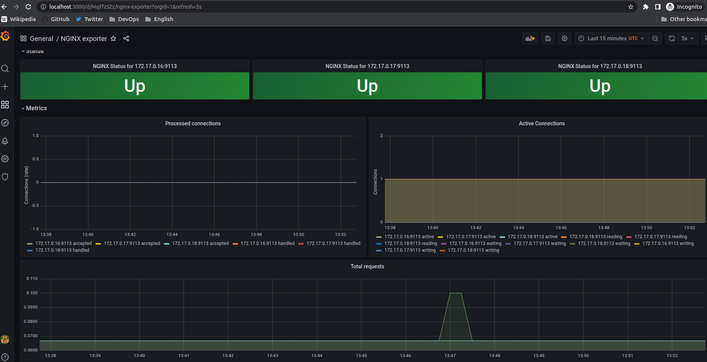

# В процессе сделано:

Установил и настроил kube-prometheus для мониторинга nginx

Dashboard - https://grafana.com/grafana/dashboards/12708

комманда для доступа к Grafana:
```
k port-forward --namespace monitoring services/grafana 3000:3000
```

Результат 
